# Flexbox - Exercises

## GAME - Flex Froggy

### Overview
In this exercise we will get familiar with **flexbox** by playing a game called **Flex Frogy**

### Getting Started
* Browse to the following link [Flexbox Froggy](https://flexboxfroggy.com/)

### Instructions
- The game consists of 24 levels.
- In each level There is scene containing a some frogs inside a pond and some lilypads.
- The target of each level is to bring the frogs to the their respective lilypads using flex properties on the pond, and sometimes on the frogs themselves.
- To solve the level, you need to write the correct css properties in the editor. Once the properties have the correct values, you will be able to proceed to the next level.
- Your goal is to finish all 24 levels

~~~
ENJOY!
~~~

## EXERCISE - Small projects
### Getting Started
In each of these exercises, you have an `html` file with a `<style>` section. In each file you have a problem which you should fix only by modifying the CSS.

### Steps
1. in `flex-box-1.html` We have a main title, and a sub title.  
 
We want that when there is enough space, the titles will be arraned next to each other so that the sub title is aligned to the end of the line:  
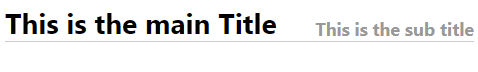 
But when there is not enough space for both texts next to each other, the subtitle will wrap to the next line:  
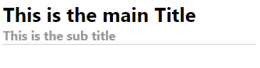

2. in `flex-box-2.html` you have a page that looks like this:  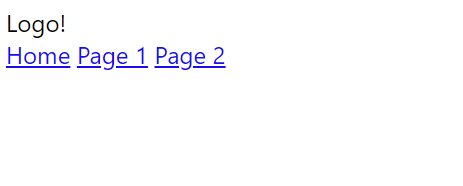  Make the required changes to make it look like this:  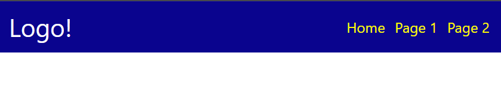

3. in `flex-box-3.html` you have a page containing some items in `
` tags.  
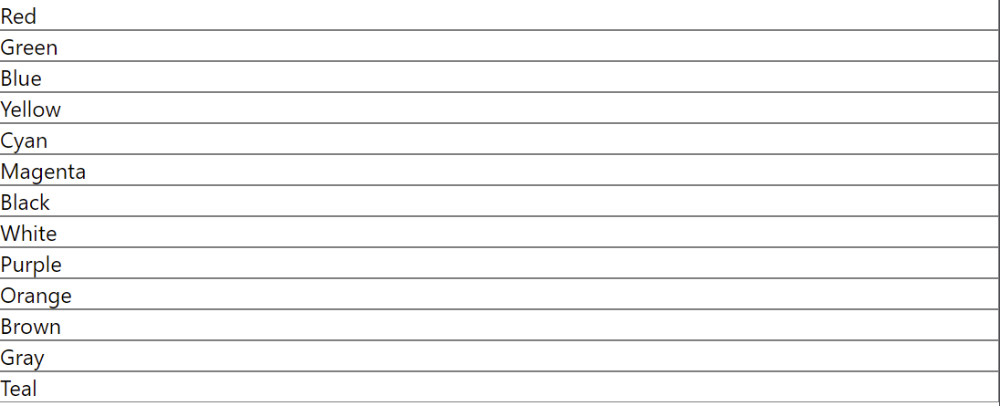 
Make the required changes to make it look like this: 
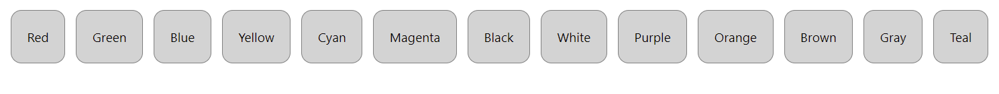 
But notice that when ther is not enough space, they need to wrap in the following way:
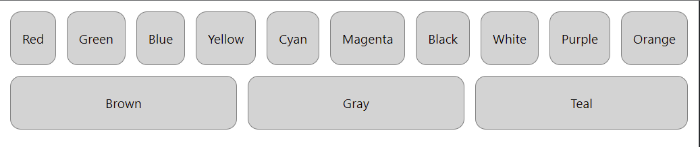 
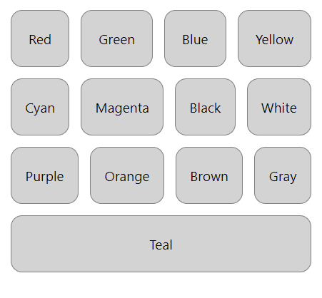 
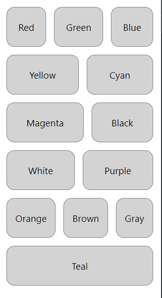 

4. Now for the fancy one. Page `flex-box-4.html` looks like this 
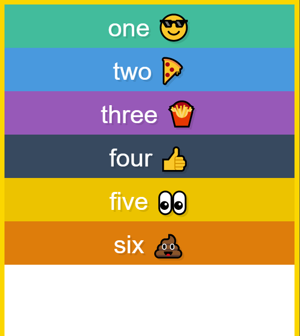 
Use your knowledge in CSS to make it look like this: 
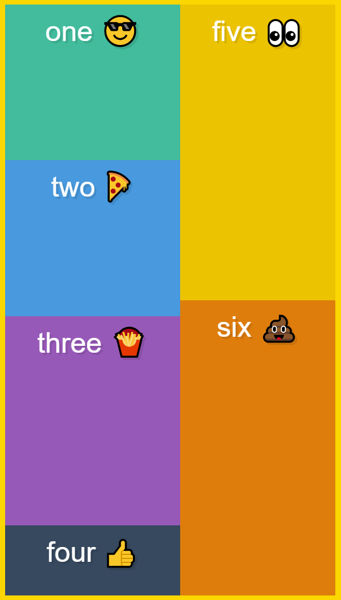

## BONUS CHALLENGES
5. In file `flex-box-5.html` you will find a page that hosts a phone app. The application has a toolbar, a bottom buttons bar, and a large content in between. 
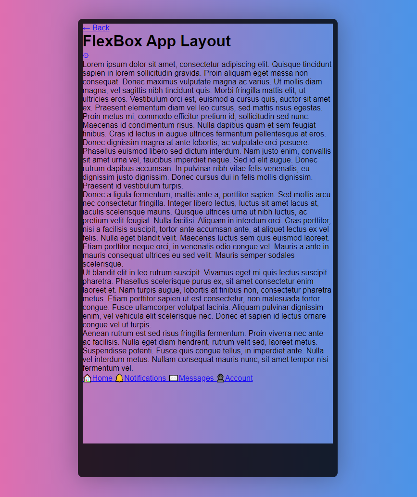 

Use everything you learned so far to make it look like this:

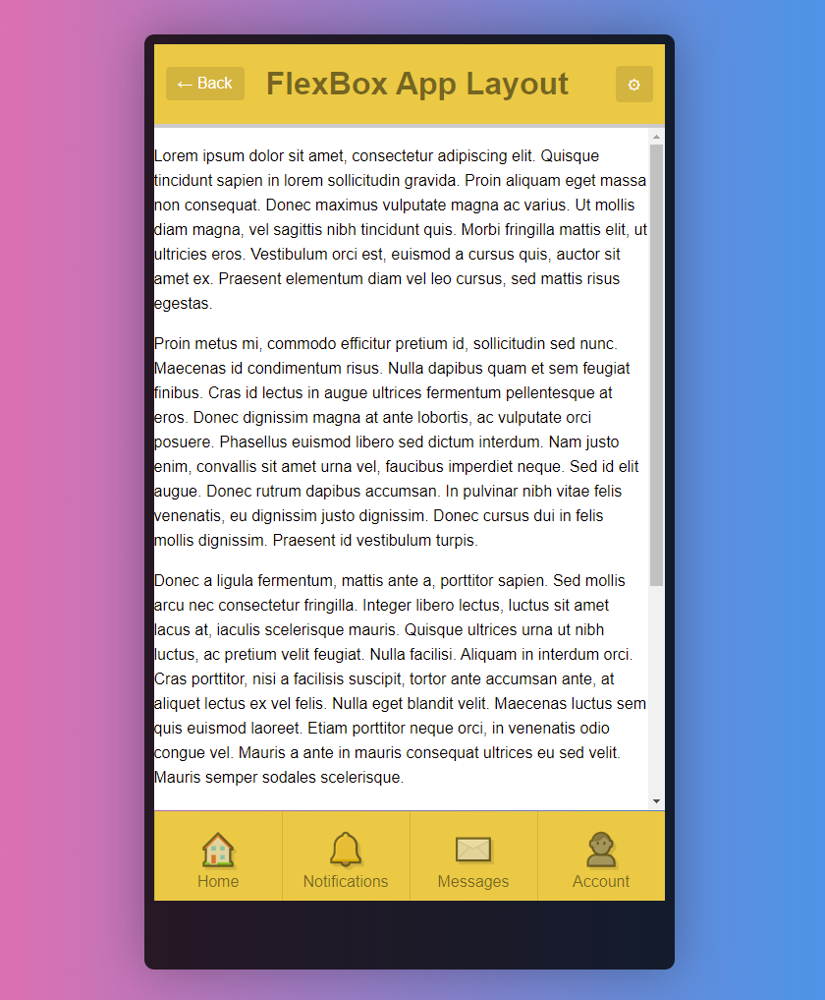

