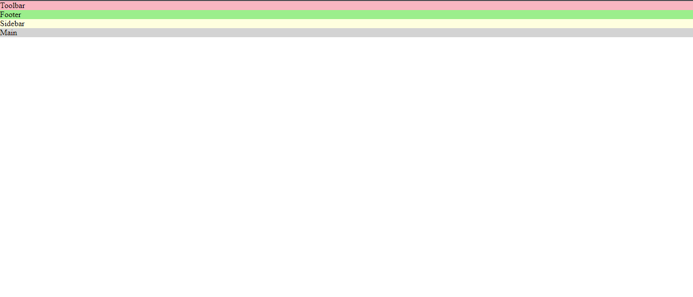
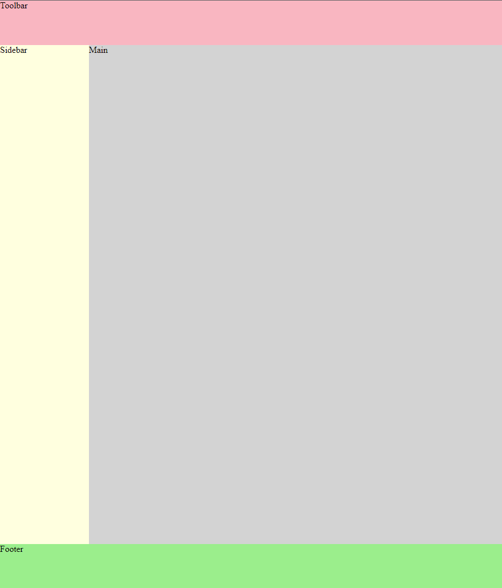
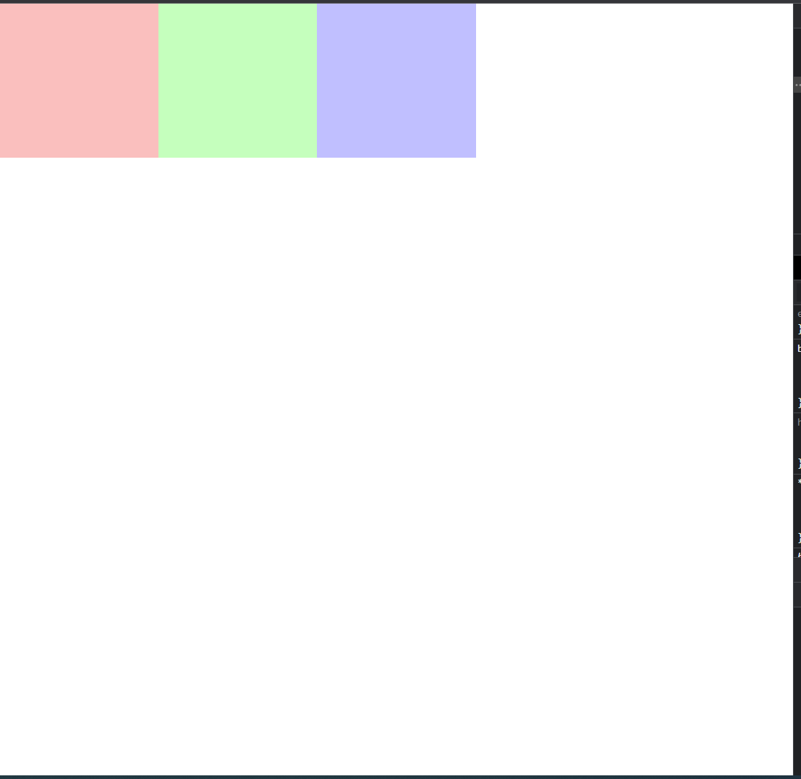
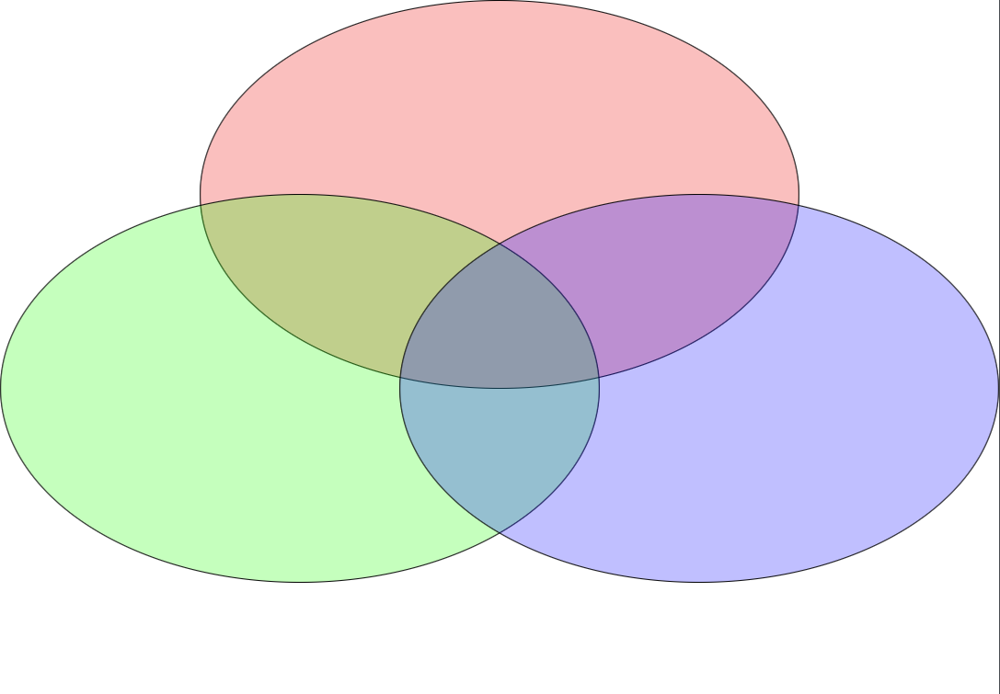

# Grid - Exercises

## GAME - Grid Garden
### Overview
In this exercise we will get familiar with **CSS grid** by playing a game called **Grid Garden**

### Getting Started
* Browse to the following link [Grid Garden](https://cssgridgarden.com/)

### Instructions
- The game consists of 28 levels.
- In each level There is scene containing a garden, divided to rows and columns, with carrots and water.
- The target of each level is to bring the water to the carrots grid properties on the garden, and sometimes on the water.
- To solve the level, you need to write the correct css properties in the editor. Once the properties have the correct values, you will be able to proceed to the next level.
- Your goal is to finish all 28 levels

~~~
ENJOY!
~~~

## EXERCISE - Small Projects
In each of these exercises, you have an `html` file with a `<style>` section. In each file you have a problem which you should fix only by modifying the CSS.

### Steps
1. in `grid-1.html` We have a toolbar, sidebar, footer and the main area.  
 
to arrange it like this:  
 

2. in `grid-2.html` you have a page containing some  `
` tags.  
 
Make the required changes to make it look like this: 
 

