# Sizes and Positions - Exercises

## Overview
In this execise we will practice the various sizing methods and functions, and the different position algorithms of CSS.

### Steps
1. in `sizing-1.html` you have a page that looks like this:  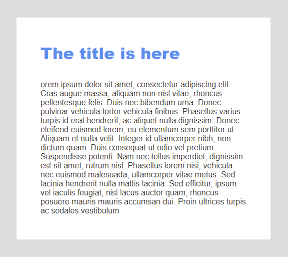  Make the required changes to make the text size adaptive:  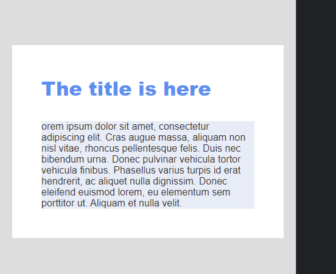 
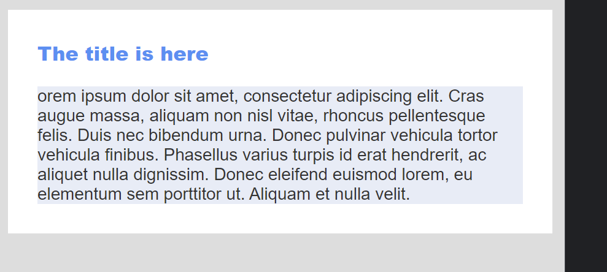 
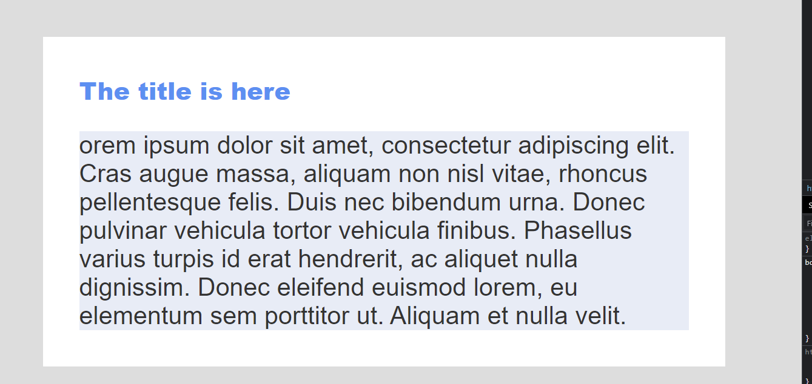 

2. in `sizing-2.html` you have a page that looks like this:  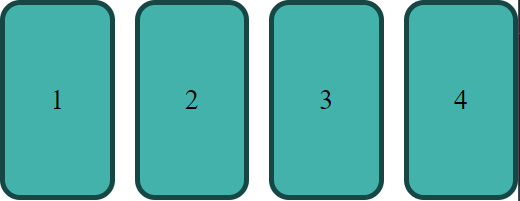  Make the required changes to make the text size adaptive:   
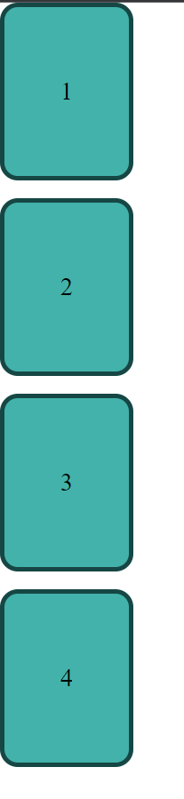 
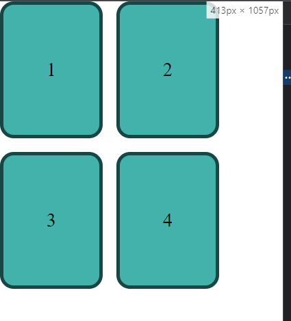 
 

3. in `sizing-3.html` you have a 4 cards that are laid out like this:  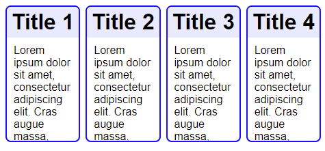  
   But notice that it does not adapt nicely to various widths
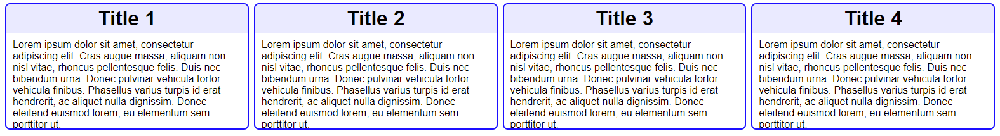 

Make the required changes so that it will use the space responsively. 

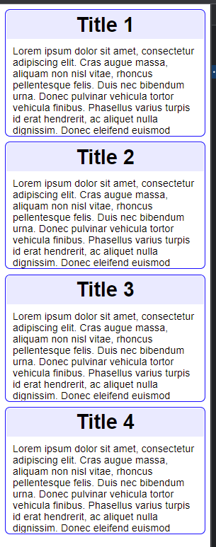 
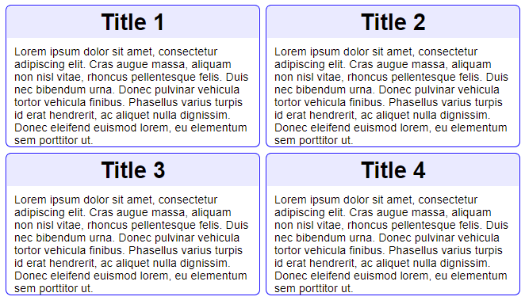 
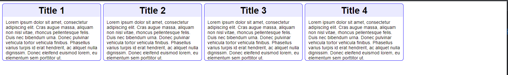 

 

