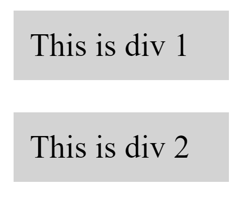
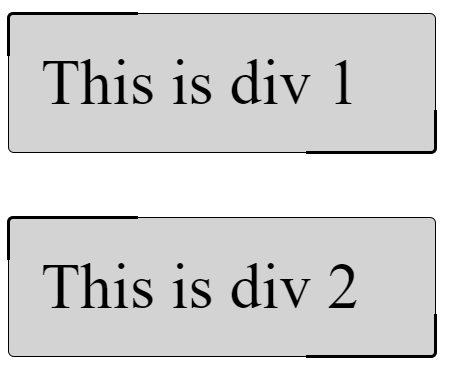
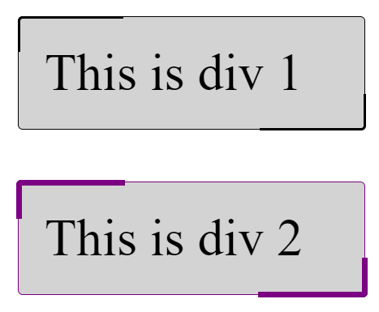
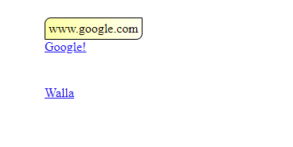

# Variables and Tricks - Exercises

## Overview
In this exercise we will practice the following topics: 
1. CSS Variables
2. the `calc` function
3. Using `::before` and `::after` creatively.

### Steps
1. in `vars-1.html` You have some `div` elements decorated with the `fancy-borders` class:  
 
    - Make the elements look like this when they have a fancy border: 
 
    - Now define two custom properties: `--fancy-thickness`, and `--fancy-color` and make them affect the thickness and color of the border. **NOTE** Make sure the decoration is aligned properly in the **middle** of the thin border. Use the `calc` function to achieve this. 
 

2. Create a tooltip to any `<a>` element that displays the address in a popup above the link. 

   - Notice the spacial border
   - Notice the gradient background
   - The image does not show it, but make it animate :-)
