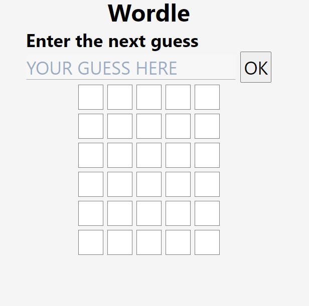

# Exercise 01 - Wordle Game in typescript

## Description
In the **WORDLE** game, the player tries to guess a 5 letter word that the computer randomly selected. The player has up to 6 guesses. In each guess the player writes a 5 letter word and the computer markes letters that are correctly placed, and letters that are in the word but are wrongly placed. If the player managed to guess the exact word in up to 6 guesses, the player wins.

## Steps
### Step 1 - Game Workspace
- Create a folder in your exercises `git` repository
- Create the starting workspace by cloning the workspace template provided [here](../workspace%20template/)
- Start the application in a browser by
  - running `npm install`
  - running `npm run wpw`
  - running `npm run serve`
  - browsing to the application address

### Step 2 - Create the HTML and CSS
Create the `html` and `css` file so that your web page looks like this:  
 
There should also be an area that will display the summary when the game is over. but this area will be invisible (`display:none`) until the game is over

### Step 3 - Create a `Game` class
The `Game` class represents the current state of the game, without the UI.
* Should hold a board of size 6 rows * 5 cells
* Should allow to query the content of each cell
  * status - which is either: empty, wrong, exists, exact
  * content - either whitespace, or a single letter
* Should tell you how many rows are filled 
* Should tell you if the game is over 
* Should tell you if the player has won or not
* `reset()` method should reset the game to its initial state
* `addGuess(guess:string)` method should add a new guess (if it is possible according to the rules and if the guess contains exactly 5 digits)
* The game should hold a list of all legal words 
  * You can find a file containing all the words [here](resources/words.ts)
  * The random word should be drawn from this list
  * Only legal words are accepted as guesses

### Step 4 - Create a `View` class
The `View` class is responsible representing the screen UI elements
* when created, finds and stores references to the various html elements
* attaches an event handler that listens to the button click. 
  * allows to set a callback of type `(guess: string) => void` for when the button is clicked
* a `renderGame(game: Game)` method refreshes the current state of the various UI elements according to the state of the game
  * Sets the content of each cell
  * Sets a class of each cell according to the status
  * If the game is over, presents the summary area, otherwise hides it
    * Fills the summary area with the proper content
    * disables the input and the button

### Step 5 - Connect the classes
* Create an instance of `Game` and an instance of `View`
* Render the initial view
* When the OK button is clicked
  * enter a new guess to the game
  * invalidate the view

