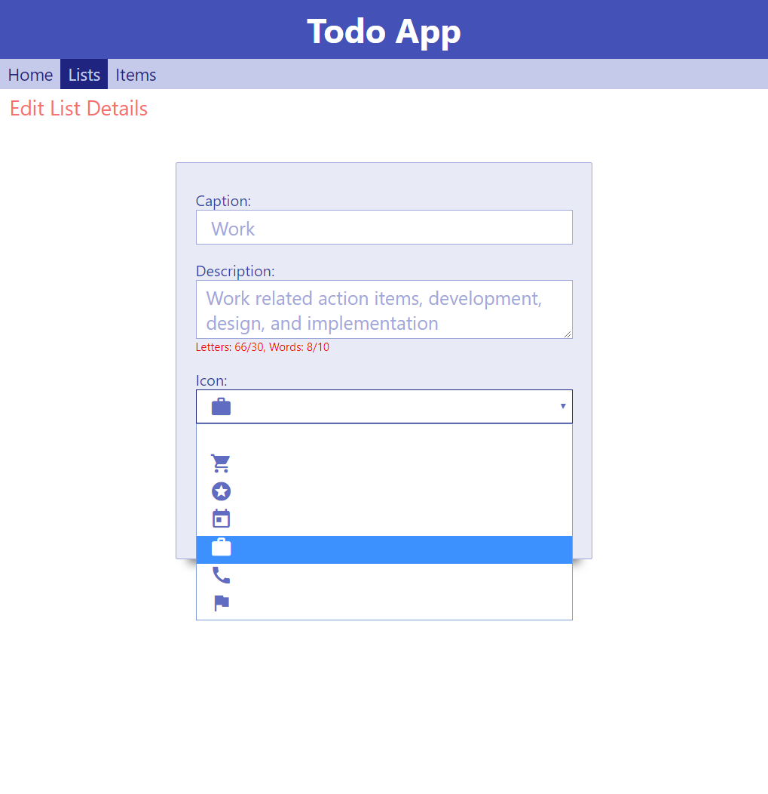

# Final Project - Todo Application
## Description
In this project we will write an application that allows the user to arrange his task list. The user can create lists, each with its own distinct title and color and image. In each list, the user may add todo items. Finally, the user may check an item to mark it as completed.

## Goals
In this project we will practice all the topics we have learned. Specifically:
* Working with models and statefull services
* Using the router to navigate between pages
* Using router guards
* Using core, routing modules to better structure our application
* Using Reactive Forms and validation to edit objects
* Using Some advanced CSS layout
* Building Components to consume the services
* Using `@Input` and `@Output` in components 

## Bonuses
* Use CSS variables to reuse colors in our application
* Use an external package: `material-icons` to present cool icons

## Screen Shots
### Home Page

### List Edit Page

### Lists Page

### List View Page

### Items Page

## Steps
### Step 1 - Data Models
In this step we will divide the application into modules and create the data model that we will work with. 
- Create a core module so you can place all models and services in it
- Create a `TodoList` Model that has the following properties: id (number), caption, descrption, image url and color.
- **Bonus - Instead of an image, you can use material design icons and let the user select an icon**
- Create a `TodoItem` Model that has the follwing properties: id (number), caption, listId, isCompleted
- Create a `AppState` Model that holds the entire state of the application. It should hold a list of `TodoList` and a list of `TodoItem`.

### Step 2 - Services
In this step we will create a state service which will hold all the data in the application. It will expose all the information as a set of obsrevables. It will expose a set of methods that update the data and trigger a "next" event on all the relevant observables.
- Create a `StateService` that holds an instance of `AppState`
    - Hold the data privately - do not expose it out.
    - Hold a private `BehaviorSubject` of the state.
    - Create the following methods that get specific parts of the state as observables
      - `getAllLists(): Observable<TodoList[]>`
      - `getListById(id): Observable<TodoList>`
      - `getAllItems(): Observable<TodoItem[]>`
      - `getItem(id): Observable<TodoItem>`
      - `getItemsOfList(listId): Observable<TodoIdem[]>`
      - `getAllNotCompletedItems(): Observable<TodoItem[]>`
    - Create methods that modify the data. Note that these methods should create new state and cause all observables to notify change
      - `AddList(caption, description, color, icon): Promise<number>` - returns the id of the newly created list
      - `ModifyList(list: TodoList): Promise<void>` - modifies the information of the list 
      - `AddTodoItem(listId, caption): Promise<number>` - adds a new TodoItem and returns the id of the newly created item
      - `MarkAsCompleted(itemId): Promise<void>` - modifies the item so that it is marked as completed
      - `DeleteList(listId): Promise<void>` - Removes the `TodoList` and all `TodoItems` that belong to it

### Step 3 - Main App layout and routing
In this step we will create the main application layout and navigation. We will create all the components, and configure the router. We will also create a navigation toolbar and draw the main layout of the application.
- Configure the router so that you have the following pages and create a component for each route
    - **/home** - Showing the name of the application, name of the developer, Todays date, The total number of todo items, and the total number of uncompleted todo items.
    - **/lists** - Showing the collection of lists that you have
    - **/lists/:id** - Showing the list description, icon and items in this list
    - **/lists/:id/edit** - Showing a form that allows you to modify the list title, description, color and icon
    - **/items** - Showing a list of all the uncompleted todo items in the application from all lists together
    - make sure the application redirects to **/home** from the empty url
    - Also add a component and route for all illegal paths showing a nice error message
- Create a navigation toolbar component with the following links
    - Home
    - Lists
    - Items
    - Use CSS to layout the toolbar and the main area so that they nicely fit the entire page and look nicely
- Implement the home page. Present the app name, developer, todays date, total todo items, total uncompleted todo items, and a button that navigates to create a new list `lists/-1/edit`

### Step 4 - Edit List
In this step we will implement the edit list view. This view is actually used for 2 purposes. To add a new list, or to modify an existing one. This view gets a list-id parameter in the url, so if the id is -1, it will mean that we are working on a new list. If it is above 0, it means that we are working on an existing list.
- Use the activated route to create an observable that holds the current `TodoList` according to the url
- Create a `FromGroup` that contains `FormControl`s for all the properties you would like to allow modifying (caption, description, color, and icon)
- Subscribe to the observable, and on next event, reset the form with the `TodoList` data. Make sure to handle the case where the data is undefined (when the id is -1)
- Draw the component itself, connect the form to the `FormGroup` and `FormControl`s. 
- Add validation so that the form is not valid until all fields are filled. Make all fields required.
- Add validation so that the description contains at least 30 characters and at least 10 words.
- Present a "Save" button that is only enabled when the form is enabled
- Present a red border around each field that is invalid
- The colors should be picked from a list using a `<select>`
- **Bonus** present the color names in the list, using the actual color.
- Finally implement the save action so that:
    - It only runs if the form is valid
    - It decides if to call `addList` or `UpdateList` according to the id. 
### Step 5 - Lists Page
In this step we will implement the lists page, that shows when the route is /lists. It will allow the user to navigate to a specific list, or to create a new one
- Show all the `TodoList` items. 
- Present each list using it's caption and color 
- Allow the user to click on it to navigate to the /lists/:id
- Add a "Add new List" button. Clicking it navigates to /lists/-1/edit
- Create a Guard, that if there are no lists to present, automatically navigates to /lists/-1/edit

### Step 6 - View List page
In this step we will present the list viewer page. It will present all the list metadata along with all the items in the list. It will present both completed and uncompleted items but will have a different presentation according to their status. It will also allow the user to mark an item as completed if it is not already so.
- Get the list id from the url 
- Use operators to create an observable of TodoList
- Use operators to create another observable of `TodoItem[]`s that belong to the list
- Present the caption, description, image
- The caption should be in the color of the list
- Add 3 buttons and navigate properly
    - Create New List
    - Delete list
    - Edit list details
- Add a todo-item-presenter component
    - It will get 2 inputs: `caption`, `isCompleted`
    - Present the caption.
    - If the item is completed, draw a check mark next to it, draw a line (strike through) through the text, and make the text a bit transparent
    - If the item is not completed, present an empty square next to it.
    - Declate A `completed` event, when the user clicks the square, trigger the event.
- Back to the list view component, use the `todo-item-presenter` component to the present the list of todo items. 
- Handle the `completed` event by calling the markAsCompleted method on the state service

### Step 7 - Adding a new Item
In this step we will continue with the list view page, and allow the user to add new items in this page. 

- Show an `<input type="text">` element under the list of items.
- Create a `FormControl` in the view model and bind the input box to it.
- Add validation so that the Form control is valid if it contains at least 10 characters and 3 words.
- Add a `+` button next to the input. The button should only be enabled when the form control is valid
- When the user clicks the button, Add new item to the list with the text as caption, **and reset the form control**

### Step 8 - Allow deleting the list
In this step we will allow the user to delete the entire list
- Show a `Delete List` button
- When the user clicks it, Show under it a message asking: Are you sure you want to delete it?
- Next to the message show two buttons. "Yes I am sure" in red and "Cancel" in green
- If the user clicks yes, delete the list and navigate to `/home`, otherwise just remove the message and the buttons

### Step 9 - Items view
In this step, we will present the user with a list of uncompleted todo items from all lists. We will again use the todo-item-presenter
- Get an observable of all uncompleted todo items from the service
- Presnet them using the `todo-item-presenter` you already implemented
- Handle the `completed` event
- If the list becomes empty - present a message "You do not have any uncompleted todo items"
